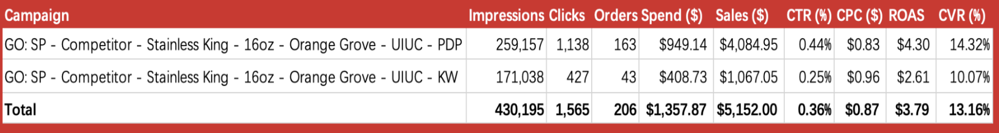
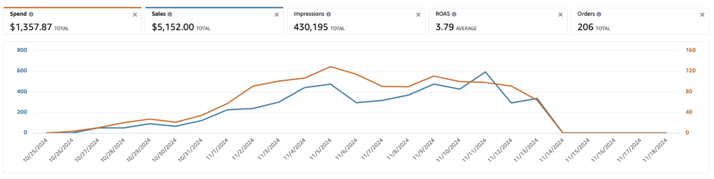

# Amazon Ads Optimization Engine

This is a small Python project I built to simulate an Amazon Ads style optimization loop.
The goal is simple, over a few “weeks” of data, move more budget to stuff that performs and stop wasting spend on obvious duds.

Built for **ADV 392: Amazon Advertising**.
Client was **Thermos**.

## Outcomes (Thermos campaign)
- **430k impressions**
- **$5152 sales** on **$1357 budget**
- **3.79 ROAS**

Proof in screenshots:
- Final outcome: [see below](#final-outcome-overall-result)
- More detailed ad metrics: [see below](#ad-metrics-breakdown-more-detailed-view)

It uses a basic epsilon greedy multi armed bandit setup, but you do not need to know the theory to run it.

## Presentation
- Slides: [ADV 392 Final Presentation - Orange Grove](https://docs.google.com/presentation/d/1Q5n_Qn-O44jlpYUjZEpmgQ5TMVQYaABlPka8Q_QeSm8/edit?usp=sharing)

## The idea in one minute
Think of each thing you can bid on as a “slot” you can put money into.

- **Arm**: one ASIN or one keyword you are bidding on
  - Examples: `B08D3VPRQ1`, `stanley travel mug`
- **Reward**: how good that arm did this week, we use ROAS and normalize it to 0 to 1 so it is easy to compare
- **Epsilon greedy**: most of the time pick what looks best, sometimes try a random arm so you do not get stuck
  - Example `epsilon=0.1` means about 10 percent explore, 90 percent exploit
- **Pruning**: if something keeps failing, stop spending on it
  - Rule in this repo: if ACOS is over the threshold and there are 0 orders for 2 weeks, it gets dropped

## What you can run
This repo includes a mock dataset with 4 weeks of performance data, shaped like an Amazon Ads style report.

When you run the CLI, it
- reads week 1, updates the bandit, maybe prunes, prints a summary
- repeats for week 2 to week N
- writes `state.json` so the numbers stick around between runs

## Quick start

```bash
python -m venv .venv
source .venv/bin/activate
pip install -r requirements.txt
```

## Example runs

Run the full 4 week simulation

```bash
python main.py --weeks 4 --budget 50 --epsilon 0.1
```

Run with pruning tuned more aggressively

```bash
python main.py --weeks 4 --budget 50 --epsilon 0.05 --prune-threshold 0.85
```

If you want to see extra prints while it runs

```bash
python main.py --weeks 4 --debug
```

Generate plots

```bash
python main.py --weeks 4 --plot
```

## What the output means
You will see lines like

- `Q=0.996` means the arm has been very strong compared to others so far
- `alloc=$12.50` means the allocator assigned that much of the weekly budget to the arm

The point is just that the allocation can change week to week as it sees more data.

## Screenshots

### Ad metrics breakdown (more detailed view)


### Final outcome (overall result)
This is the final outcome of the algo
- 430k impressions
- $5152 sales on $1357 budget
- 3.79 ROAS



## Tests

```bash
pytest
```

